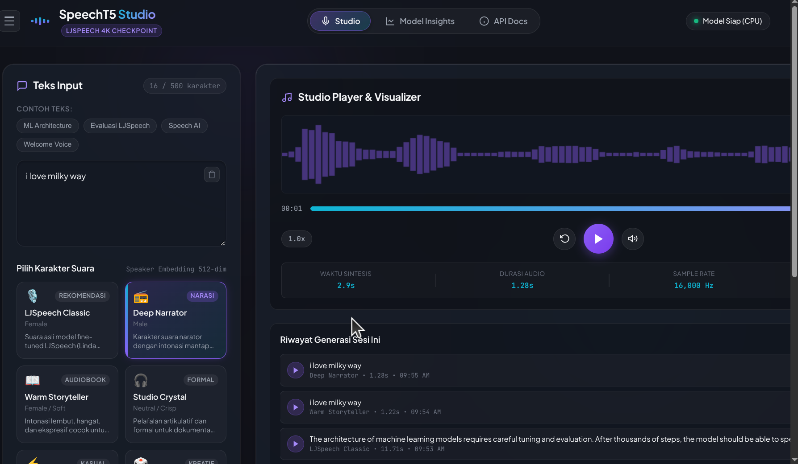

# SpeechT5 Studio | Neural Text-to-Speech

Aplikasi web interaktif untuk Text-to-Speech (TTS) menggunakan model neural **SpeechT5** yang telah di-*fine-tune* pada dataset **LJSpeech**, dikombinasikan dengan neural vocoder **HiFi-GAN**.



## 🚀 Fitur Utama

- **Sintesis Audio Real-time**: Mengubah teks bahasa Inggris menjadi ucapan manusia dengan intonasi natural.
- **Waveform Visualizer**: Visualisasi audio secara real-time langsung di browser menggunakan Web Audio API.
- **Advanced Controls**: Atur kecepatan pelafalan (0.5x - 2.0x) dan atur *random seed* untuk mendapatkan variasi suara yang konsisten.
- **Model Insights Dashboard**: Menampilkan visualisasi performa dan karakteristik dari model yang digunakan (Kurva Pembelajaran, Mel-Spectrogram, Waveform, dan Distribusi Data).
- **Responsive & Dynamic UI**: Desain antarmuka Dark Mode yang modern, *glassmorphism*, dengan animasi interaktif. Dilengkapi fitur *expand player* dan *collapse sidebar* untuk kenyamanan.

## 🛠️ Tech Stack

- **Backend**: Python 3.11+, FastAPI, Uvicorn
- **Machine Learning**: PyTorch, 🤗 Transformers (`microsoft/speecht5_tts`, `microsoft/speecht5_hifigan`)
- **Audio Processing**: `soundfile`
- **Frontend**: HTML5, Vanilla JS, Vanilla CSS

## 📂 Assets

Proyek ini menyertakan beberapa aset visual di dalam folder `asset/`:
- `demo.gif` - Animasi demonstrasi cara penggunaan aplikasi web.
- `tampilanWeb.png` - Tangkapan layar antarmuka utama SpeechT5 Studio.
- `kurvaPembelajaran.png` - Grafik loss model selama proses pelatihan (fine-tuning).
- `mel-spectrogram.png` - Contoh fitur akustik Mel-Spectrogram yang dihasilkan oleh model.
- `wavefrom(amplitudo-volume-terhadap-waktu).png` - Visualisasi amplitudo audio keluaran terhadap waktu.
- `distribusi.png` - Visualisasi distribusi durasi audio pada dataset pelatihan.

## ⚙️ Persyaratan Sistem

- **Python**: Versi 3.11 atau lebih baru
- Model SpeechT5 LJSpeech yang telah disiapkan di dalam folder `model_speecht5_ljspeech/`

## 📦 Cara Instalasi

1. **Clone repositori ini:**
   ```bash
   git clone https://github.com/LordDarkness99/text-to-speech.git
   cd text-to-speech
   ```

2. **Buat Virtual Environment (opsional namun sangat disarankan):**
   ```bash
   python -m venv .venv
   source .venv/bin/activate  # Untuk Linux/Mac
   # atau
   # .venv\Scripts\activate   # Untuk Windows
   ```

3. **Instal Dependensi:**
   ```bash
   pip install -r requirements.txt
   ```

## 🚀 Cara Menjalankan Aplikasi

Anda dapat menggunakan script bash yang telah disediakan:
```bash
./run.sh
```

Atau jalankan secara manual menggunakan Uvicorn:
```bash
source .venv/bin/activate
uvicorn backend.main:app --host 0.0.0.0 --port 8000 --reload
```

Setelah server berjalan, buka browser dan akses URL: **`http://localhost:8000`**

## 💡 Panduan Penggunaan Web

1. **Input Teks**: Ketik teks bahasa Inggris pada kolom yang disediakan (maksimal 500 karakter). Anda juga bisa menggunakan contoh teks dari tombol chip (Misal: *ML Architecture*).
2. **Pengaturan Lanjutan (Opsional)**: Buka tab pengaturan lanjutan untuk mengatur *seed* (mengubah sedikit warna suara) dan kecepatan bicara.
3. **Sintesis Suara**: Tekan tombol **Sintesis Suara** atau gunakan shortcut `Ctrl + Enter`.
4. **Pemutaran Audio**: Setelah audio berhasil di-generate, klik tombol **Play** (atau tekan spasi). Anda akan melihat visualisasi gelombang suara beranimasi di panel kanan.
5. **Fleksibilitas Layout**:
   - Tekan tombol **Hamburger (☰)** atau shortcut `H` untuk menyembunyikan/menampilkan panel input kiri.
   - Tekan tombol **Expand** di pojok kanan atas player atau shortcut `E` untuk memperbesar ukuran panel audio player.
6. **Unduh Audio**: Anda dapat mengunduh hasil audio sebagai file `.wav` menggunakan tombol *Download* di dalam history.

## 📚 API Dokumentasi

Web app ini menyediakan interaktif API documentation bawaan FastAPI (Swagger UI).
Kunjungi **`http://localhost:8000/docs`** ketika server sedang berjalan untuk melihat dokumentasi API dan mencoba endpoints (seperti `/api/synthesize` dan `/api/health`).
